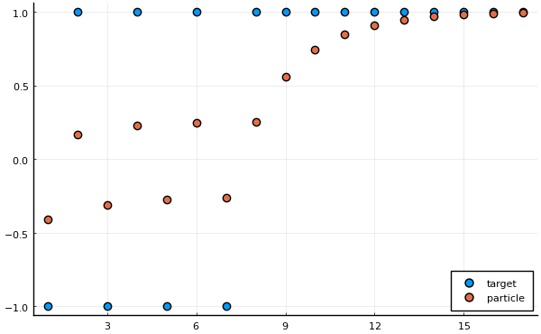
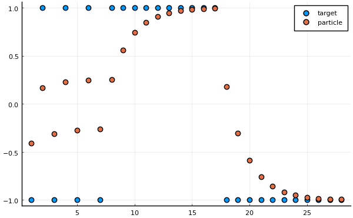

```@meta
EditURL = "<unknown>/particle.jl"
```

# Using IterationControl.jl to control a particle tracker

```julia
using Pkg
Pkg.activate(@__DIR__)
Pkg.instantiate()

using Plots
pyplot(size = (600, 300*(sqrt(5) -1)))

using IterationControl
```

```
 Activating environment at `~/Dropbox/Julia7/MLJ/IterationControl/examples/particle/Project.toml`

```

Consider an object that tracks a particle in one dimension, moving
in discrete time at a speed proportional to the distance away from
some moving target. We are viewing this particle as a toy example of
online learning and call the constant of proportionality `η` as a
*learning rate*.

The particle is initially at rest at the origin, which is also where
the target begins.

Calling `train!` on the particle moves it along for the specified
number of time steps, while calling `ingest!` updates the target
position ("data ingestion").

```julia
mutable struct Particle
    position::Float64
    target::Float64
    velocity::Float64
    η::Float64 # learning rate
    Particle(η) = new(0.0, 0.0, 0.0, η)
end

Particle(; η=0.1) = Particle(η)

loss(model::Particle) =  abs(model.target - model.position)
```

```
loss (generic function with 1 method)
```

A train method for one time step:

```julia
function train!(model::Particle)
    model.velocity = model.η*(model.target - model.position)
    model.position = model.position + model.velocity
end
```

```
train! (generic function with 1 method)
```

And for multiple time steps:

```julia
function train!(model, n)
    foreach(1:n) do _
        train!(model)
    end
    return nothing
end
```

```
train! (generic function with 2 methods)
```

A method for updating the target:

```julia
function ingest!(model::Particle, target)
    model.target = target
    return nothing
end
```

```
ingest! (generic function with 1 method)
```

Lifting the `train!`, `loss` and `ingest!` methods:

```julia
IterationControl.train!(model::Particle, n) = train!(model, n)
IterationControl.loss(model::Particle) = loss(model)
IterationControl.ingest!(model::Particle, datum) = ingest!(model, datum)
```

Lets `train` our particle by alternatively setting the target
position to -1 or +1 every 5 time-steps, for a total of 40 (4 -1/+1
cycles) and then allow our particle to "cruise" with the target
fixed thereafter (the provided `data` iterator having
been exhausted). This cruising is allowed to continue until the
particle is with 0.01 of the target.

We use a learning rate of 0.1.

```julia
model = Particle(0.1)
data = repeat([-1, 1], outer=4)
```

```
8-element Array{Int64,1}:
 -1
  1
 -1
  1
 -1
  1
 -1
  1
```

```julia
target_positions = Float64[]
particle_positions = Float64[]

function callback!(model)
    push!(target_positions, model.target)
    push!(particle_positions, model.position)
end

IterationControl.train!(model,
                        Data(data),
                        Step(5),
                        Callback(callback!),
                        Threshold(0.01),
                        TimeLimit(0.005));

scatter(target_positions, label="target", ms=6)
scatter!(particle_positions, label="particle", ms=6)
```


```julia
loss(model)
```

```
0.006513954865740357
```

Switching the target just once more to the -1 position and
continuing training until the particle and target are withing 0.01:

```julia
data = [-1,]

IterationControl.train!(model,
                        Data(data),
                        Step(5),
                        Callback(callback!),
                        Threshold(0.01),
                        TimeLimit(0.005));

scatter(target_positions, label="target", ms=6)
scatter!(particle_positions, label="particle", ms=6)
```


---

*This page was generated using [Literate.jl](https://github.com/fredrikekre/Literate.jl).*

